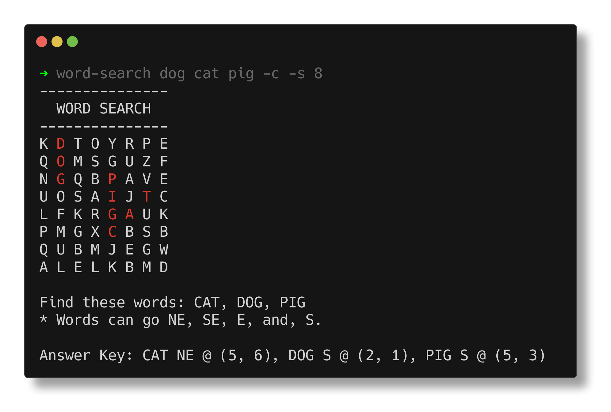

# Welcome to Word-Search-Generator

Word-Search-Generator is a Python module for generating fun [Word Search Puzzles](https://en.wikipedia.org/wiki/Word_search).

  

Like most of my programming endeavors, Word-Search-Generator was born out of necessity. I needed an easy way to generate a bunch of word search puzzles for kid's food menus at the day job.

🤦‍♂️ Does the world need this? Probably not.  
⏰ Did I spend way too much time on it? Yep!  
✅ Does it come in handy? Heck yeah!  
👍 Did I have fun making it? Absofreakinglutly!  

## Contributors

- Chris J.M. [@duck57](https://github.com/duck57)
